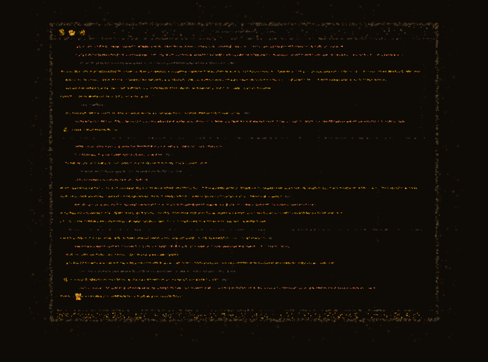

  

  <strong>Ian Walmsley</strong> · Agentic Engineer

  Building <a href="https://github.com/packetloss404/packetcode">Building PacketCode — an AI-assisted development workspace that unifies Claude Code and OpenAI Codex CLI into a multi-pane environment with session management, issue tracking, GitHub integration, persistent memory, configurable agent profiles, MCP server management, project scaffolding, and deployment workflows. 
  Interested in Building in Puiblic?

  <a href="https://www.youtube.com/@packetloss404">📺 YouTube</a> ·
  <a href="https://discord.gg/eygyg7pQ">💬 Discord</a> ·
  <a href="https://www.ianlan.dev">🌐 ianlan.dev</a>

