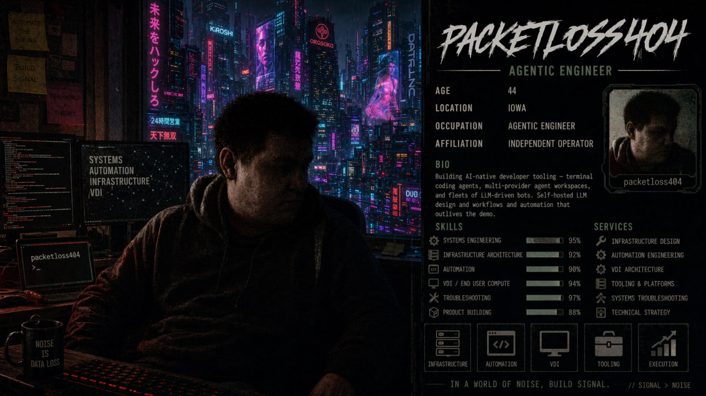
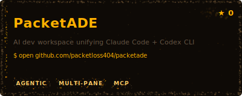
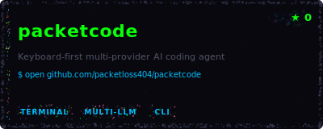
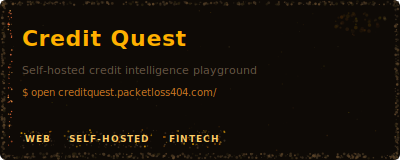

<p align="center">
  
</p>

```
packetloss404@void:~$ whoami
> Ian Walmsley — Agentic Engineer
> agents in, packets out
```

## currently building

> Shipping across a stack of agent-driven tools — **PacketADE** stitches Claude Code + Codex CLI into a single multi-pane workspace, **packetcode** is the keyboard-first terminal coding agent behind it, **vibesocial** and **vibebbs** experiment with community infra for the streamer / BBS crowd, **taskloom** is the lightweight task engine holding it all together, and **mc-server-bot** keeps the self-hosted Minecraft fleet running.
>
> [PacketADE](https://github.com/packetloss404/packetade) · [packetcode](https://github.com/packetloss404/packetcode) · [vibesocial](https://github.com/packetloss404/vibesocial) · [taskloom](https://github.com/packetloss404/taskloom) · [mc-server-bot](https://github.com/packetloss404/mc-server-bot) · [vibebbs](https://github.com/packetloss404/vibebbs)

## projects

<table>
<tr>
  <td width="33%" align="center"><a href="https://github.com/packetloss404/packetade"></a></td>
  <td width="33%" align="center"><a href="https://github.com/packetloss404/packetcode"></a></td>
  <td width="33%" align="center"><a href="https://creditquest.packetloss404.com"></a></td>
</tr>
</table>

## latest from the lab

<p align="center">
<a href="https://www.youtube.com/watch?v=tB2kS0MhOb0"></a><br><sub>Vellum — Built with Claude Opus 4.7 (Cerebral Valley Hackathon 2026)</sub>
</p>

## recent shipments

- `taskloom` — [Retire activation signal SQLite mirror](https://github.com/packetloss404/taskloom/commit/d1ce43792fec2cd723b715a839534715e68f5cbd) <sub>· 2026-04-27</sub>
- `PacketADE` — [feat(agents): Cursor-style pane redesign + soft Workspace binding](https://github.com/packetloss404/PacketADE/commit/02655fa450bd0060d7a55d9b8c83c3e2be16534a) <sub>· 2026-04-27</sub>
- `taskloom` — [Add Phase 36 relational repository for invitation email deliveries](https://github.com/packetloss404/taskloom/commit/aae1653229a41e2c5345c50830dfb10b32134681) <sub>· 2026-04-27</sub>
- `vellum` — [fixtures: add stress2/3/4 routes via shared FixtureHost, prune submission docs](https://github.com/packetloss404/vellum/commit/577c8edaecb1fde42296d8840f3c4e8e2d549733) <sub>· 2026-04-26</sub>
- `taskloom` — [Add Phase 10 activation signal hardening](https://github.com/packetloss404/taskloom/commit/77ea46704302be29074aad4294a681d23f1e554d) <sub>· 2026-04-26</sub>

---

<p align="center">
  <a href="https://www.youtube.com/@packetloss404"><code>[ y ] youtube</code></a> ·
  <a href="https://discord.gg/eygyg7pQ"><code>[ d ] discord</code></a> ·
  <a href="https://creditquest.packetloss404.com"><code>[ c ] credit quest</code></a>
</p>

<p align="center"><sub>last refresh: <code>2026-04-28</code> · auto-built from <code>templates/README.template.md</code></sub></p>
