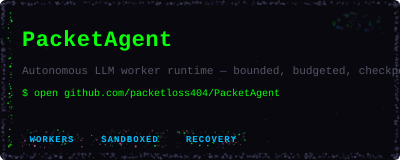
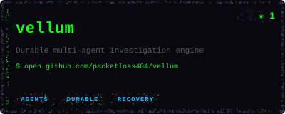
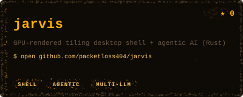
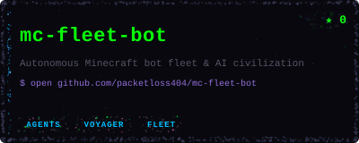

<p align="center">
  
</p>

```
packetloss404@void:~$ whoami
> Ian Walmsley — Platform Engineer
> Enterprise infrastructure · AI platforms · developer tooling
> Iowa · Remote
packetloss404@void:~$ cat ~/.site
> https://www.packetloss404.com  # what I build, and why
> https://ianwalmsley.me         # the career side
```

## what I build

Agent infrastructure, end-to-end — multi-provider LLM routers (hand-rolled, no SDKs), MCP clients & servers from scratch, Voyager-style agent loops, sandboxed tool runtimes, RAG, and agent evaluation inside synthetic worlds: closed-sandbox internets, simulated enterprise networks, and autonomous Minecraft civilizations. Production-minded: real test suites, security (SSRF defense, credential vaults, hash-chained audit logs), and durable persistence.

Two decades of enterprise infrastructure underneath it — VMware/Omnissa, Azure, identity, storage, networking, and the automation that replaced the manual version of all of it. That's why these ship with permission engines, audit logs, and sandboxes instead of a shell call and optimism.

`TypeScript` · `Rust` · `Python` · `Go` · `PowerShell` · LLM orchestration · MCP · agents · evals · simulation

## featured

<table>
<tr>
  <td width="33%" align="center"><a href="https://github.com/packetloss404/PacketADE"></a></td>
  <td width="33%" align="center"><a href="https://github.com/packetloss404/packetcode"></a></td>
  <td width="33%" align="center"><a href="https://github.com/packetloss404/PacketAgent"></a></td>
</tr>
<tr>
  <td width="33%" align="center"><a href="https://github.com/packetloss404/vellum"></a></td>
  <td width="33%" align="center"><a href="https://github.com/packetloss404/jarvis"></a></td>
  <td width="33%" align="center"><a href="https://github.com/packetloss404/mc-fleet-bot"></a></td>
</tr>
</table>

## currently

> Building the Packet suite end-to-end — PacketADE (agentic dev environment, v0.10.2), packetcode (terminal coding agent), and PacketAgent, the worker runtime behind them: bounded, budgeted, checkpointed LLM workers running in a network-isolated sandbox with effect receipts and digest-chained crash recovery. Alongside it, mc-fleet-bot's autonomous Minecraft civilization — and private R&D on closed-sandbox agent-evaluation worlds, a multi-agent fleet orchestrator, and an evidence-first investigation workspace with chain-of-custody and deterministic archive export.
>
> [packetloss404.com](https://www.packetloss404.com) · [PacketADE](https://github.com/packetloss404/PacketADE) · [PacketAgent](https://github.com/packetloss404/PacketAgent) · [packetcode](https://github.com/packetloss404/packetcode) · [mc-fleet-bot](https://github.com/packetloss404/mc-fleet-bot)

---

<p align="center">
  <a href="https://www.packetloss404.com"><code>[ www ] packetloss404.com</code></a> ·
  <a href="https://ianwalmsley.me"><code>[ cv ] ianwalmsley.me</code></a> ·
  <a href="https://www.linkedin.com/in/Iwalmsley"><code>[ in ] linkedin</code></a> ·
  <a href="https://github.com/packetloss404"><code>[ gh ] github</code></a>
</p>

<p align="center"><sub>last refresh: <code>2026-08-01</code> · auto-built from <code>templates/README.template.md</code></sub></p>
