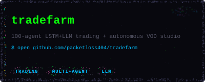
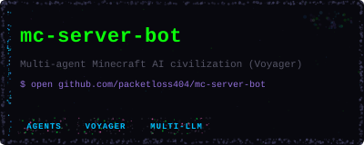

<p align="center">
  
</p>

```
packetloss404@void:~$ whoami
> Ian Walmsley — AI / Agent Engineer
> Iowa · Remote
```

## what I build

Applied-AI engineer shipping agent infrastructure end-to-end — multi-provider LLM routers (hand-rolled, no SDKs), MCP clients & servers from scratch, Voyager-style agent loops, sandboxed tool runtimes, RAG, and agent-evaluation harnesses. Production-minded: real test suites, security (SSRF defense, credential vaults, hash-chained audit logs), and durable persistence.

`TypeScript` · `Rust` · `Python` · `Go` · LLM orchestration · MCP · agents · evals

## featured

<table>
<tr>
  <td width="33%" align="center"><a href="https://github.com/packetloss404/packetade"></a></td>
  <td width="33%" align="center"><a href="https://github.com/packetloss404/packetcode"></a></td>
  <td width="33%" align="center"><a href="https://github.com/packetloss404/vellum"></a></td>
</tr>
<tr>
  <td width="33%" align="center"><a href="https://github.com/packetloss404/taskloom"></a></td>
  <td width="33%" align="center"><a href="https://github.com/packetloss404/tradefarm"></a></td>
  <td width="33%" align="center"><a href="https://github.com/packetloss404/mc-server-bot"></a></td>
</tr>
</table>

## currently

> Maturing the agent stack — packetcode (terminal coding agent), PacketChat, and a synthetic-world agent-evaluation engine — plus packetphone (real-time AI telephony) and unifying my Minecraft-agent and agent-evaluation platforms into one simulation framework.
>
> [packetcode](https://github.com/packetloss404/packetcode) · [tradefarm](https://github.com/packetloss404/tradefarm) · [mc-server-bot](https://github.com/packetloss404/mc-server-bot)

---

<p align="center">
  <a href="https://www.linkedin.com/in/Iwalmsley"><code>[ in ] linkedin</code></a> ·
  <a href="https://github.com/packetloss404"><code>[ gh ] github</code></a>
</p>

<p align="center"><sub>last refresh: <code>2026-06-04</code> · auto-built from <code>templates/README.template.md</code></sub></p>
