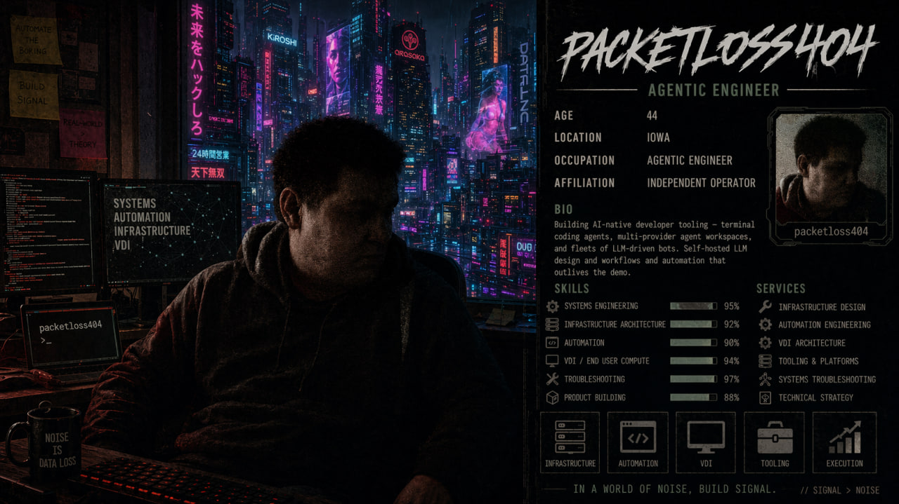
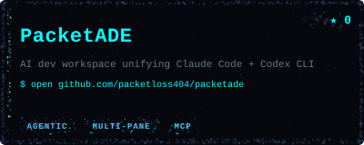
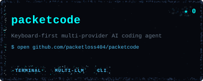
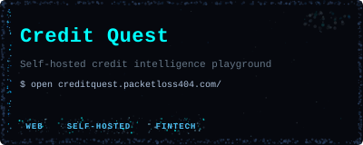

<p align="center">
  
</p>

```
packetloss404@void:~$ whoami
> Ian Walmsley — Agentic Engineer
> sleepless in /dev/stdout
```

## currently building

> Shipping across a stack of agent-driven tools — **PacketADE** stitches Claude Code + Codex CLI into a single multi-pane workspace, **packetcode** is the keyboard-first terminal coding agent behind it, **vibesocial** and **vibebbs** experiment with community infra for the streamer / BBS crowd, **taskloom** is the lightweight task engine holding it all together, and **mc-server-bot** keeps the self-hosted Minecraft fleet running.
>
> [PacketADE](https://github.com/packetloss404/packetade) · [packetcode](https://github.com/packetloss404/packetcode) · [vibesocial](https://github.com/packetloss404/vibesocial) · [taskloom](https://github.com/packetloss404/taskloom) · [mc-server-bot](https://github.com/packetloss404/mc-server-bot) · [vibebbs](https://github.com/packetloss404/vibebbs)

## projects

<table>
<tr>
  <td width="33%" align="center"><a href="https://github.com/packetloss404/packetade"></a></td>
  <td width="33%" align="center"><a href="https://github.com/packetloss404/packetcode"></a></td>
  <td width="33%" align="center"><a href="https://creditquest.packetloss404.com"></a></td>
</tr>
</table>

## latest from the lab

<p align="center">
<a href="https://www.youtube.com/watch?v=tB2kS0MhOb0"></a><br><sub>Vellum — Built with Claude Opus 4.7 (Cerebral Valley Hackathon 2026)</sub>
</p>

## recent shipments

- `PacketADE` — [polish(toolbar): move Theme toggle to its own slot at the far right](https://github.com/packetloss404/PacketADE/commit/a6299df03c70f40525625eeea07d23b8a75c8823) <sub>· 2026-05-16</sub>
- `mc-server-bot` — [Fix migration ordering: indexes run after migrations, not before](https://github.com/packetloss404/mc-server-bot/commit/b62659a61f55a5b8a498f597bc454f150eb7a4f5) <sub>· 2026-05-16</sub>
- `mc-server-bot` — [Merge followups/small: 5 small followups closed](https://github.com/packetloss404/mc-server-bot/commit/e286a01c96cb56dda3e3e3847e867bb51aa8bc3e) <sub>· 2026-05-16</sub>
- `PacketADE` — [chore(v0.8.3): version bump + CHANGELOG](https://github.com/packetloss404/PacketADE/commit/aeb183987ed58ae1452f771f7dea1affa8e859ca) <sub>· 2026-05-16</sub>
- `mc-server-bot` — [Merge feature/town-builder: 8-phase Autonomous Town Builder + followups](https://github.com/packetloss404/mc-server-bot/commit/d571c765f3df8195e6161047475af01fa109bd22) <sub>· 2026-05-16</sub>

---

<p align="center">
  <a href="https://www.youtube.com/@packetloss404"><code>[ y ] youtube</code></a> ·
  <a href="https://discord.gg/eygyg7pQ"><code>[ d ] discord</code></a> ·
  <a href="https://creditquest.packetloss404.com"><code>[ c ] credit quest</code></a>
</p>

<p align="center"><sub>last refresh: <code>2026-05-16</code> · auto-built from <code>templates/README.template.md</code></sub></p>
