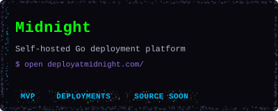
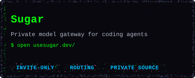
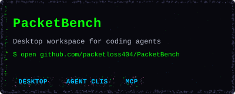
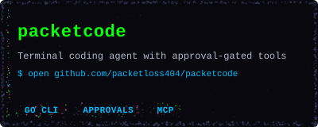

<p align="center">
  
</p>

```
packetloss404@void:~$ whoami
> Ian Walmsley — Platform Engineer · Forward Deployed AI Engineer
> Enterprise infrastructure · customer implementation · AI platforms
> Iowa · Remote
packetloss404@void:~$ cat ~/.site
> https://www.packetloss404.com  # what I build, and why
> https://ianwalmsley.me         # the career side
```

## what I build

Customer-ready AI platforms, end-to-end — multi-provider LLM routers (hand-rolled, no SDKs), MCP clients & servers from scratch, Voyager-style agent loops, sandboxed tool runtimes, RAG, and agent evaluation inside synthetic worlds: closed-sandbox internets, simulated enterprise networks, and autonomous Minecraft civilizations. Production-minded: real test suites, security (SSRF defense, credential vaults, hash-chained audit logs), and durable persistence.

A career in enterprise infrastructure underneath it — VMware/Omnissa, Azure, identity, storage, networking, and the automation that replaced the manual version of all of it. I work from customer constraints through architecture, implementation, and production support. That's why these systems ship with permission engines, audit logs, and sandboxes instead of a shell call and optimism.

`TypeScript` · `Rust` · `Python` · `Go` · `PowerShell` · LLM orchestration · MCP · agents · evals · simulation

## featured

Deployment, model routing, and agent development. Midnight's source is coming soon; Sugar's remains private. For now, their cards link to public product pages.

<table>
<tr>
  <td width="50%" align="center"><a href="https://deployatmidnight.com/"></a></td>
  <td width="50%" align="center"><a href="https://usesugar.dev/"></a></td>
</tr>
<tr>
  <td width="50%" align="center"><a href="https://github.com/packetloss404/PacketBench"></a></td>
  <td width="50%" align="center"><a href="https://github.com/packetloss404/packetcode"></a></td>
</tr>
</table>

## more of the work

Beyond the featured four, these projects show the range of systems I build. DocVault has public source; the others have private source and are described on the [workbench](https://www.packetloss404.com/#private).

- **[docvault](https://github.com/packetloss404/docvault)** — Document management with ingestion, RAG search, e-signatures, and legal hold.
- **synapse** — Enterprise workspace and endpoint operations with policy-bounded remediation and XLA reporting.
- **blackboxai** — Structured, simulated environments for testing AI agents.
- **Continuum** — A personal finance workspace for bank accounts, brokerage portfolios, and AI insights.
- **lumaflow** — Studio operations for photographers, from bookings and contracts to payments and client galleries.

## currently

> Building deployment and model-routing systems with Midnight and Sugar, alongside connected coding tools in PacketBench and packetcode. Open to remote-first Platform Engineering and Forward Deployed AI roles, with onsite work considered for the right team and location.
>
> [packetloss404.com](https://www.packetloss404.com) · [Midnight](https://deployatmidnight.com/) · [Sugar](https://usesugar.dev/) · [PacketBench](https://github.com/packetloss404/PacketBench) · [packetcode](https://github.com/packetloss404/packetcode)

---

<p align="center">
  <a href="https://www.packetloss404.com"><code>[ www ] packetloss404.com</code></a> ·
  <a href="https://ianwalmsley.me"><code>[ cv ] ianwalmsley.me</code></a> ·
  <a href="https://www.linkedin.com/in/Iwalmsley"><code>[ in ] linkedin</code></a> ·
  <a href="https://github.com/packetloss404"><code>[ gh ] github</code></a>
</p>

<p align="center"><sub>last refresh: <code>2026-10-14</code> · auto-built from <code>templates/README.template.md</code></sub></p>
